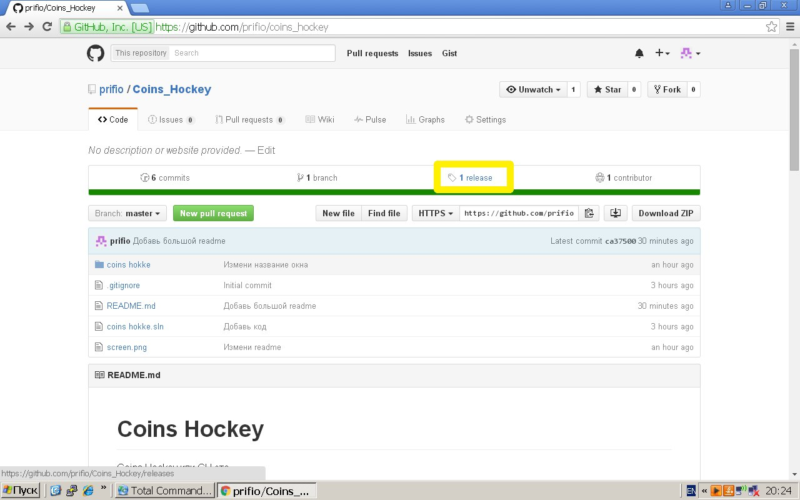
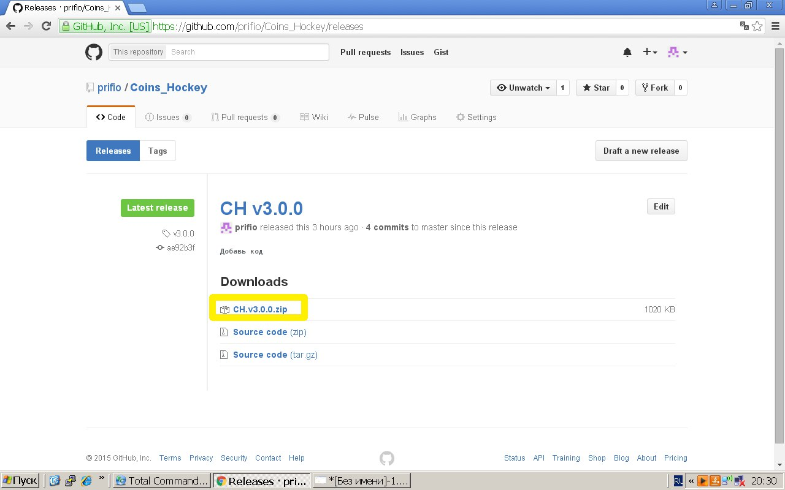
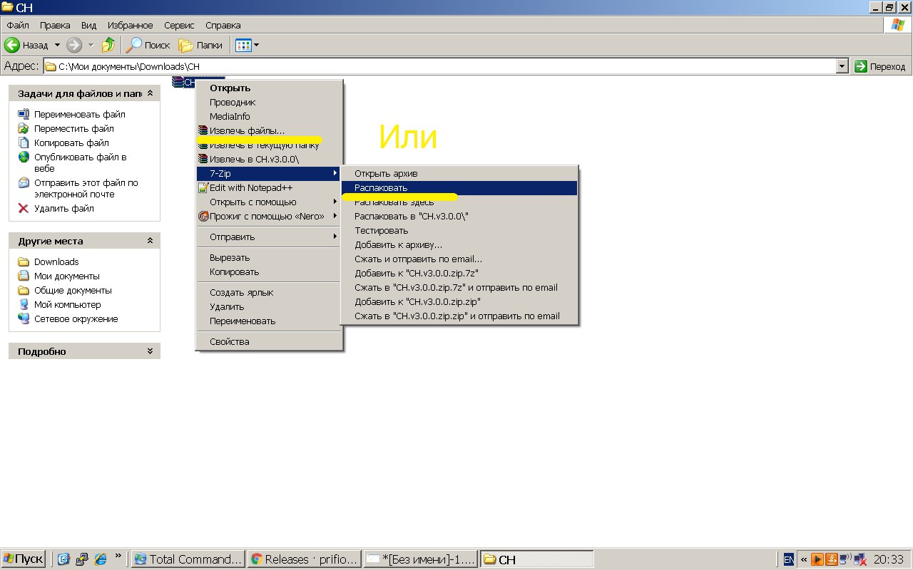

# Coins Hockey
Coins Hockey или CH это
+ рабочая физика;
+ 26 видов монет;
+ реалистичные данные;
+ система прокачки;
+ и просто способ забавно провести время.

# Как играть?

## Скачать последнюю версию
Перейдите на список релизов (третья кнопка над списком файлов).

В последнем релизе(latest release) найдите ссылку на игру (это не source code!) 

## Разархивировать
Нажмите правую кнопку мыши на архиве -> извлечь. Укажите папку, куда хотите поместить игру. Главное не забудьте, где она нахдится!

##Запустить
Всё просто. Ищите CHbin.exe. Запускайте. Вы в игре.

##Управление
Нажимаете на монету. Затем, не отжимая мышь, оттяните её как рогатку. Отпустите. Чем дальше отвели - тем сильнее полетит монетка (в пределах разумного, конечно). 
Если вы выбрали монету и вдруг захотели сходить другой - то нажмите на правую кнопку мыши. 
Понятно, что если мы ударим чуть левее шайбы, то шайба полетит в право. Так можно заставить шайбу полететь в нужном вам направлении.
Учтите, что у тяжёлых монет существует заметный разброс

## Сочетания клавишd
+ Загрузить сохранение - Ctrl + R (read)
+ Сделать сохранение - Ctrl + S (save)
+ Начать/остановить запись - R (replay)
+ Пауза/продолжить - Escape

##Удачный момент?
Скачайте специальную [программу для чтения повторов](https://github.com/prifio/CHreplay)

##Про запись replay
Сейчас записать replay довольно просто. Нажимаете escape. Дальше есть кнопка начать запись. Если запись идет, то во время игры в левом верхнем углу видно, в какой файл идет запись. Вы так же можете сами выбрать файл, в который будет записываться ваш replay. В меню паузы можно ввести имя этого файла. Причем новый replay не удалит старый с таким же именем. Если вы хотите остановить replay, то в меню паузы нажмите соответственную кнопку. Если вам не понравилось то, что вы записали - можете сразу его удалить (кнопка "удалить запись")

##Тонкости
Партия ведётся до двух очков.
Размер прибыли зависит от количества забитых голов и от стоимости вашей команды.
Первые две пары ходов нельзя забить гол (то есть, действует иммунитет). 
Количество оставшихся ходов до конца имуннитета можно посмотреть в верхнем левом углу.

##Подключение к интернету
Сейчас для игры не требуется подключение к интернету. 
Вы можете загружать своё сохранение, но перезаписать его без подключения к интернету не получится

Другие игры и подробнее про CH [здесь](http://vk.com/my_programs)

Приятной игры.
